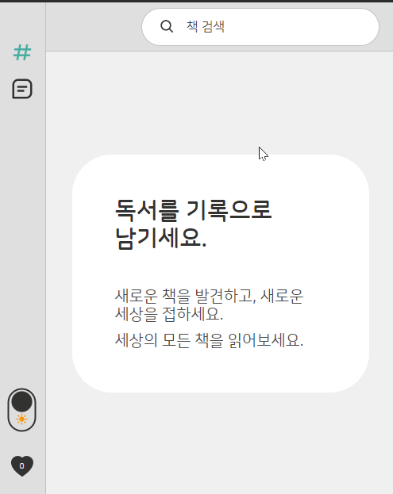
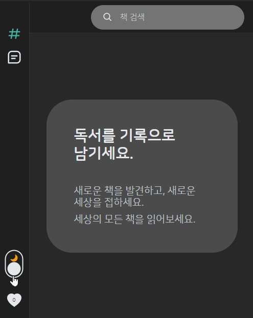
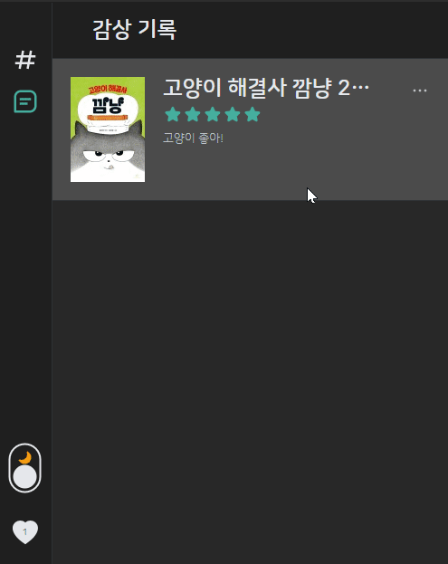

# 프로젝트 소개

- **독서 기록 앱**
- 네이버 open api를 활용한다.
- 책에 별점과 감상평을 남길 수 있다.
- 책의 주요 정보를 확인할 수 있다.

## 배포

[**사용해보기**](https://mocha-book-search.netlify.app/)

## 목적

아래의 리스트를 공부하고 적용한다.

- 무한 스크롤
- bright / dark theme
- typeScript
- redux

## 작업 기간

- 21.04.22 ~ 21.05.20
- 1인 프로젝트

## 사용된 기술 & 주요 라이브러리

- React
- redux, redux-thunk
- react-router-dom
- axios
- typescript
- styled-components
- **responsive design**

# 주요 기능

## 검색어 자동 완성



## 무한 스크롤


## light / dark theme



## 기타

### 전반적인 ux flow


### 감상평 수정



- 감상평, 별점을 수정할 수 있다.

### 바깥을 클릭하여 닫기


# 주요 코드

## 1. 날짜 포맷 변환 코드

- 첫번째 함수:

  - `new Date()`로 생성한 날짜의 포맷을
  - `YYYYMMDD:string`로 포맷 변환

- 두번째 함수:

  - `YYYYMMDD:string`의 포맷을 `YY년 MM월 DD일`로 포맷 변환

- 두개로 나눠서 제작한 이유
  - `naver open api`로 가져오는 `pubdate`변수가 `string 타입`임
  - `감상평`의 작성시간은 `new Date()`로 만들었음
  - 따라서 두개로 나누는게 관리하기 편하고 확장성면에서 좋다고 판단함

### 첫번째 함수

```js
useEffect(() => {
  const date: number = createdAt.getDate();
  let month: number | string = createdAt.getMonth() + 1;
  const year: number = createdAt.getFullYear();

  if (month < 10) month = '0' + month;

  const fullDate: string = '' + year + month + date;

  setPubDate(fullDate);
}, [createdAt]);
```

### 두번째 함수

```js
const settingDate = useCallback((pubDate: string) => {
  let date = pubDate.split('');
  const year = date.splice(0, 4).splice(2, 2).join('');
  const month = date.splice(0, 2).join('');
  const day = date.join('');

  setDate({ year, month, day });
}, []);
```

#### 다른 버젼

- 위의 버젼은 시간복잡도가 `On`이지만
- 아래의 버젼은 시간복잡도가 `O1`이다.
- 하지만 더 코드양이 더 길고, 뭔가 쉽게 읽혀지지 않는 것 같다. 🤔
- 이런 경우는 어떤걸 쓰는게 좋을지 모르겠다...

```js
const settingDate = useCallback((pubDate: string) => {
  let pubday = Number(pubDate);
  let day: number | string = pubday % 100;
  if (day < 10) day = '0' + day;

  pubday = Math.trunc(pubday / 100);
  let month: number | string = pubday % 100;
  if (month < 10) month = '0' + month;

  pubday = Math.trunc(pubday / 100);
  let year: number | string = pubday % 100;
  if (year < 10) year = '0' + year;

  day = day.toString();
  month = month.toString();
  year = year.toString();

  if (
    typeof day === 'string' &&
    typeof month === 'string' &&
    typeof year === 'string'
  )
    setDate({ year, month, day });
}, []);
```

## 2. 메뉴창 바깥을 클릭하여 메뉴창 꺼지기

```JS
  const menuRef = useRef<HTMLDivElement>(null);

  // ...

  // 키보드의 Escape 를 누르면 꺼짐
  const escapeMenu = useCallback((event: KeyboardEvent) => {
    if (event.key === 'Escape') close();
  }, []);

  // menuRef의 내부에 있는 node가 아닐 경우 꺼짐
  const closeMenu = useCallback((event) => {
    const target: HTMLDivElement = event.target;
    if (!menuRef.current?.contains(target)) close();
  }, []);

  useEffect(() => {
    document.addEventListener('mousedown', closeMenu);
    document.addEventListener('keydown', escapeMenu);
    return () => {
      document.removeEventListener('mousedown', closeMenu);
      document.removeEventListener('keydown', escapeMenu);
    };
  }, [escapeMenu, closeMenu]);
```

## 3. 무한 스크롤

- 마지막 node가 보일 때, (`IntersectionObserver`사용하여 판별)
- 검색을 더 하도록 함

```js
  const observer = useRef<IntersectionObserver>(null);

  const lastElement = useCallback(
    (node) => {
      if (isLoading) return;

      // current가 있을 경우, 이전의 것이니까 지워줌
      if (observer.current) observer.current.disconnect();

      // 새로 node를 달아주고, 이 node가 보일 경우 데이터를 더 가져온다
      observer.current = new IntersectionObserver((entries) => {
        if (entries[0].isIntersecting && hasMore) {
          dispatch(loadMoreData());
          dispatch(fetchBooks(query, pageNumber));
        }
      });
      if (node) observer.current.observe(node);
    },
    [isLoading, hasMore, pageNumber, dispatch, query]

  return (
    <>
      <ListContainer>
        {data?.map((item, index) => {
          if (data.length === index + 1) {
            return (
              <li key={item.isbn} ref={lastElement}>
                <SearchModuleContainer item={item} />
              </li>
            );
          } else {
            return (
              <li key={item.isbn}>
                <SearchModuleContainer item={item} />
              </li>
            );
          }
        })}
      </ListContainer>
    </>
  );
```

## 4. 모달의 두가지 기능(추가, 수정)

### 감상평 추가인지 기존 감상평의 수정인지 판별

- 모달을 여는 `modal.action` 함수의 두번째 인자에 판별 용 payload을 넘김
- 새로운 감상평 추가일 경우 `book` 정보 전달

```js
const addNewComment = useCallback(() => {
  if (data) dispatch(openModal(true, { book: data }));
}, [dispatch, data]);
```

- 감상평 수정일 경우 `코멘트의 id` 전달

```js
const modifyComment = useCallback(() => {
  dispatch(openModal(true, { id }));
}, [dispatch, id]);
```

- 코멘트 컴포넌트에서 `modal.reducer`을 가져와서 가지고있는게 `book`인지 `id`인지 확인 후, `payload`를 전달함

```js
const { modalPayload } = useSelector(
  (state: RootReducerType) => state.modalReducer
);
const { payload } = useSelector(
  (state: RootReducerType) => state.recordReducer
);

const submit = useCallback(() => {
  // 새로운 감상평 추가일 경우
  if (modalPayload?.book) dispatch(addComment(comment, modalPayload.book));

  // 기존 감상평 수정일 경우
  if (modalPayload?.id) dispatch(modifyComment(modalPayload.id, comment, rate));

  // 모달 창 닫기
  dispatch(openModal(false));
}, [modalPayload, dispatch, comment, rate]);
```

## 5. 검색 액션

```js
const URL = '/v1/search/book.json';

// 캔슬 토큰 사용 목적
let cancel: () => void;

const instance = axios.create({
  headers: {
    'X-Naver-Client-Id': process.env.REACT_APP_CLIENT_ID,
    'X-Naver-Client-Secret': process.env.REACT_APP_CLIENT_SERVER,
  },
});

export const fetchBooks =
  (query: string, page = 1) =>
  async (dispatch: Dispatch<fetchDispatchType>) => {
    if (!query) return;
    dispatch({ type: FETCH });

    cancel && cancel();

    try {
      const {
        data: { items, total },
      } = await instance.get(URL, {
        params: { query, display: 8 * page, start: page },
        cancelToken: new axios.CancelToken((c) => (cancel = c)),
      });

      if (page === 1) {
        dispatch({
          type: FETCH_SUCCESS,
          data: items,
          hasMore: page * 8 < total,
          query: query,
        });
      } else {
        dispatch({
          type: LOAD_MORE_SUCCESS,
          data: items,
          hasMore: page * 8 < total,
        });
      }
    } catch (error) {
      if (axios.isCancel(error)) return;
      dispatch({
        type: FETCH_FAIL,
      });
    }
  };
```

# 문제 해결 경험

## 검색어를 변경해도 기존의 스크롤위치때문에 fetch가 더 많이 되는 버그

### 원인

- 무한스크롤은 스크롤위치에 의해 fetch가 더 됨
- 스크롤을 내려서 검색 결과가 `기존 검색결과 갯수인 8개` 보다 더 많을 때,
- 검색어를 수정해도 기존의 스크롤 위치에 영향을 받아서 _`8개` 보다 많은 검색결과가 도출됨_

### 해결 시도

- 매 검색마다 `window.scroll(0,0)`으로 스크롤을 올리려 하였으나 해결되지 못함

### 해결

- `input`의 값이 update 될 때마다, 기존 검색결과를 초기화함

```js
useEffect(() => {
  if (query.length) {
    dispatch(newFetch()); // 기존 검색 결과 초기화
    dispatch(fetchBooks(query, 1)); // 검색
  }
}, [query, dispatch]);

const onChange = useCallback((event: React.ChangeEvent<HTMLInputElement>) => {
  setQuery(event.target.value);
}, []);
```

## 모달에 다양한 방법을 시도

### 첫번째 시도

- react-router-dom에서 제공하는 기능을 이용하여, 모달에도 url을 설정하려고 하였음.
  - `/book/:isbn`페이지의 `감상평남기기`버튼을 클릭하여 모달을 오픈할 경우, `/comment/:isbn` 와 같은 모달 고유의 url을 작성하고 싶었음.
  - 공식홈페이지에서 제공하는 [예시](https://reactrouter.com/web/example/modal-gallery)를 참고함.
- 해당 페이지의 `location`에 `state`옵션이 더 있을 경우 모달이 열리고, 모달 뒤로 기존의 페이지가 보이게 하는 원리.

#### 원인

- `<Switch>`에 `location`을 적용할 때 타입 에러가 계속 발생함
- `location.state`까지는 타입이 지정되어있어도 그이후까진 안되어있어서 그런 것 같음

```js
  let location = useLocation();
// location.state는 되지만, location.state.background 는
// undefined 타입에러가 발생함
  let background = location.state && location.state.background;
 return (
   <div>
     <Switch location={background || location}>
```

#### 해결

해결 하지 못함

### 두번째 시도

- 리액트에서 제공하는 `createPortal`을 사용하여 모달을 관리하려고 함.

#### 원인

- [예시](https://react-typescript-cheatsheet.netlify.app/docs/basic/getting-started/portals/)를 참고하여 코드를 작성하였음
- 타입스크립트 타입 관련 에러가 계속 발생함

#### 해결

해결 하지 못함

### 결론

- [이전 프로젝트](https://github.com/mochapoke/design-system#%ED%95%B4%EA%B2%B0)와 마찬가지로 redux를 이용하여 on/off 함
- 모달은 `App`파일 내 다른 페이지보다 상위에 작성함.

```js
// App.js
return (
  <ThemeProvider theme={theme === 'light' ? lightTheme : darkTheme}>
    <IconContext.Provider value={{ className: 'icons' }}>
      <GlobalStyles />
      <Container>
        <CommentContainer /> 👈 모달
        <Header toggle={themeToggler} />
        <Switch>
          <Route exact path='/' component={LandingPage} />
          <Route exact path='/book/:id' component={DetailPage} />
          <Route exact path='/record' component={RecordPage} />
          <Route path='/404' component={NotFound} />
          <Redirect to='/404' />
        </Switch>
      </Container>
    </IconContext.Provider>
  </ThemeProvider>
);
```

# 🌼 후기

- react-router-dom 문서를 좀더 자세히 훑어보는 계기가 됨
  - 다음 프로젝트에선 꼭 모달 고유의 url을 사용하는 프로젝트를 만들어 보고 싶음
- 익숙하지 않던 typescript와 redux에 조금은 익숙해 진 것 같음
  - typescript를 사용한 redux는 처음에 구조를 짤 때는 매우매우 귀찮고 번거롭지만, 사용할 때는 자동 제시`(crtl + spacebar)`가 되다보니 매우 편하다고 느낌.
  - > 이래서 큰 프로젝트를 만들 때 타입스크립트를 사용하는 구나!
  - 그래도 막상 다음 개인 프로젝트에 적용하기엔 손이 안감... 🤯
- 개인 프로젝트를 그래도 3개 쯤 진행하다보니 리액트의 폴더 구조에 대한 나만의 sorting system이 생기고 정착한 것 같음.

## 🚀 총평

- 어렵게만 생각했던 `typescript`와 `reudx`를, 둘이 동시에 쓰다니! 심지어 이번이 두개 기술을 쓰는 **첫 프로젝트!!** 🤯🤯🤯
- 하지만 공부하고, 코드를 작성하다보니 막상... 그렇게 어렵게만 생각하지 않아도 된다는걸 느꼈다.
- **결론: 일단 하면 된다.**
